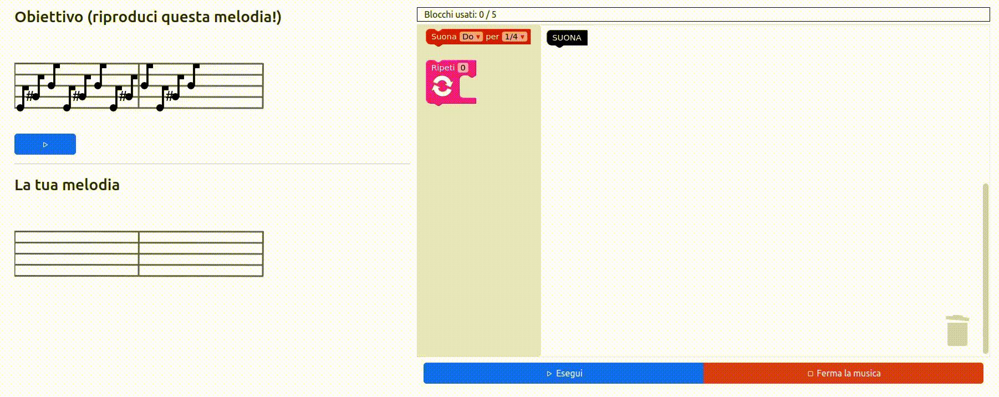

# Blockly Music Microworld

A programming microworld, built with [canvas](https://developer.mozilla.org/en-US/docs/Web/API/Canvas_API) and [Blockly](https://developers.google.com/blockly/), and wrapped in a simple [React](https://react.dev/) app.

The exercises of this microworld (specifications in `src/exercises.js`) task users with reproducing the melody shown on the upper left using a block-based programming language that includes iteration and conditional constructs and functions. The application reproduces melodies directly on the browser by using the [AudioContext](https://developer.mozilla.org/en-US/docs/Web/API/AudioContext) interface.

To run:
* Clone the repository
* `cd` to the main project folder
* Run `npm install`
* Run `npm start`
* The project will be up at `localhost:3000`